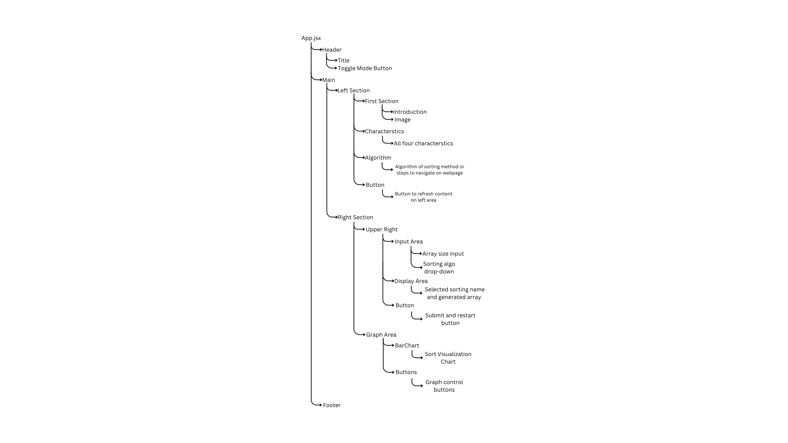

# Sorting-Visualizer

### Introduction
- This is a sorting algorithm visualizer in which 6 sorting algorithms are visualized through Bar Graph.
- It's a frontend project in which we have tried to implement dynamic, responsive and smooth UI using react.js.

### Contributer
- Krish kumar

### Project structure

### Technology Used
- HTML
- CSS
- React.js
- Chart.js
- JavaScript

### Features
- Visualize the sorting procedure of different sorting algorithms by referring to dynamically updating Bar Charts.
- Learn about their theoretical concepts like definition, time and space complexity their comparison graphs and other characterstics.
- Switch from Light mode to Dark mode and vice versa.
- Detailed visualization through pause, play and resetting Bar Charts.

### Quick guide of WebPage
- 1. Select the size of array.
- 2. Select desired Sorting Algorithm.
- 3. Click on Submit button to visualize sorting.
- 4. Pause Button: You can use this button to pause the sorting at any point and understand it.
- 5. Reset Button: You can use this button to reset the sorted data to its default format.
- 6. Start Button: You can use this button to start sorting the data to again after resetting.

### Site deploy link (netlify) -
Deployment Link -> https://sortify-sar.netlify.app/